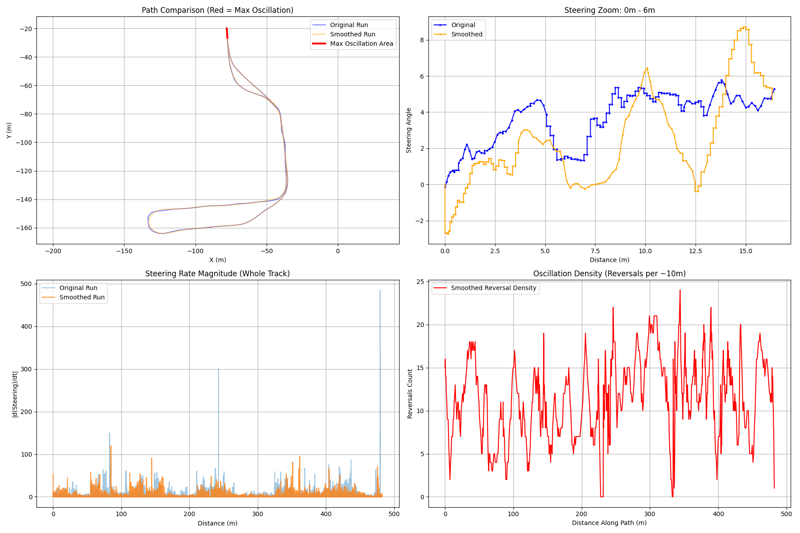
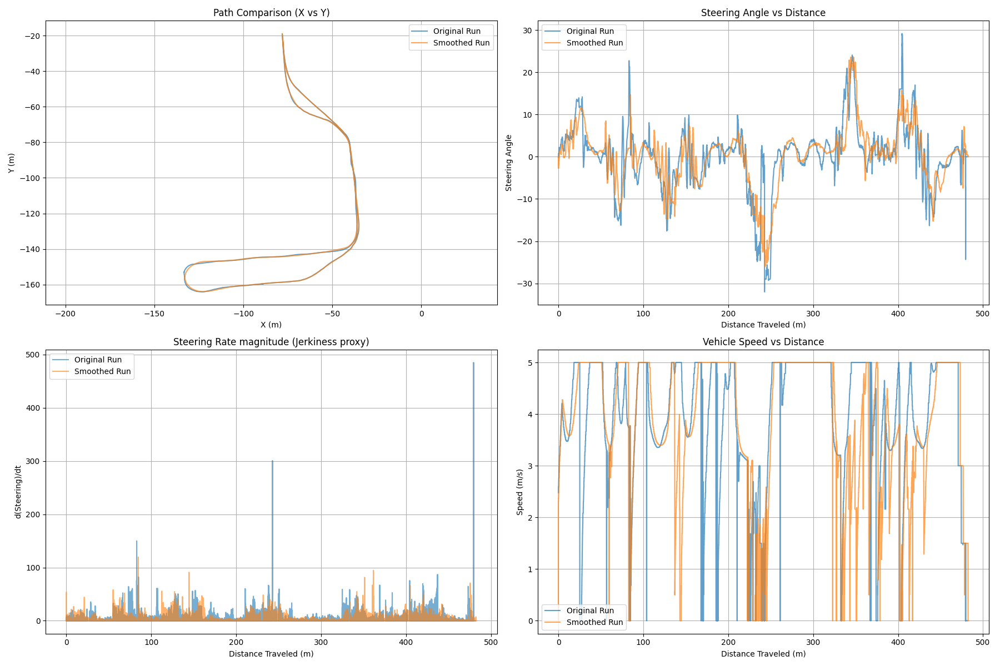

# Analysis of Buggy Runs: Original vs Smoothed

This report analyzes the recorded data from the "Original" and "Smoothed" runs to investigate the user's observation of "association" (oscillation/instability) despite the smoothing process.

## Key Findings

> [!WARNING]
> **Severe Oscillation Hotspot Identified**: The analysis detected a specific location where steering reversal is extreme.
> *   **Location**: X=-77.90, Y=-20.11
> *   **Track Section**: The very beginning of the run (0.0m to 6.4m).
> *   **Severity**: **100 reversals in 100 samples**. This means the steering is vibrating left/right at *every single time step* in this section.

> [!NOTE]
> **Overall Instability**: While peak jerk is reduced, the **frequency of steering reversals increased by 12%** globally across the track. This confirms the user's feeling of "association" — the vehicle is "micro-correcting" or hunting constantly.

### Statistics Summary

| Metric                       | Original Run   | Smoothed Run   | Change                                  |
| :--------------------------- | :------------- | :------------- | :-------------------------------------- |
| **Max Steering Angle**       | 32.01          | 26.00          | -18.8% (Smoother turns)                 |
| **Max Steering Rate (Jerk)** | 485.06         | 119.54         | -75.4% (Significantly less violent)     |
| **Mean Abs Steering Rate**   | 3.93           | 2.77           | -29.5% (Generally smoother)             |
| **Steering Reversals**       | **189 / 100m** | **212 / 100m** | **+12.2% (More frequent oscillations)** |

## Visual Analysis

### Hotspot & Reversal Density

*   **Top Left (Path)**: The Red segment shows the area of maximum oscillation.
*   **Bottom Right (Density)**: The Red line shows the density of steering reversals. Note the massive spike at the beginning (0-10m) and sustained higher density throughout compared to what would be expected from a "smooth" path.

### General Comparison

### Interpretation
1.  **Start-up Instability**: The extreme oscillation at the start (X=-77.90, Y=-20.11) suggests the vehicle initializes with a large error or the controller is unstable at low speeds/startup.
2.  **Steering Reversals**: Despite lower amplitude, the Smoothed run has more frequent zero-crossings or direction changes (hunting).
3.  **Controller Tuning**: The vehicle controller appears overtuned for the smoothed path, reacting too aggressively to small deviations.

## Recommendations
1.  **Investigate Start Point**: Check the path data at X=-77.90, Y=-20.11. Is there a discontinuity or noise in the very first few waypoints?
2.  **Tune Controller**: Reduce P/D gains or increase deadband to stop the "hunting" behavior.
3.  **Low Speed Logic**: If the oscillation is speed-dependent (worst at start/low speed), implement a speed-dependent gain scheduling or suppression for steering control.
